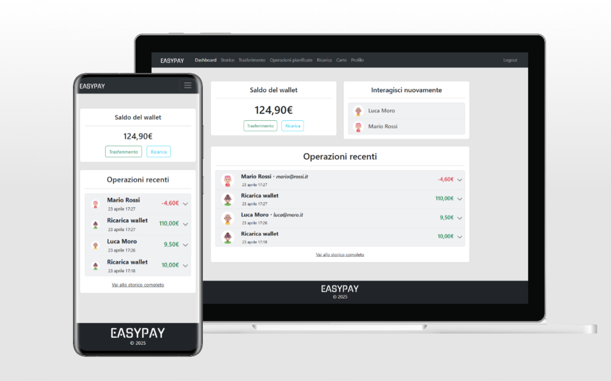

# EasyPay

EasyPay è un’applicazione full-stack basata su API progettata per il settore finanziario: banche e
fintech. Offre servizi moderni e sicuri per la gestione di conti.


---

## Indice

1. [Caratteristiche](#caratteristiche)
2. [Tecnologie](#tecnologie)
3. [Struttura del progetto](#struttura-del-progetto)
5. [Avvio locale](#avvio-locale)
6. [Configurazione iniziale](#configurazione-iniziale)
7. [Documentazione API](#documentazione-api)

---

## Caratteristiche

- **Creazione di un utente**: registrazione semplice e accesso immediato per iniziare a gestire le finanze
- **Trasferimento fondi**: invio e ricezione di denaro in tempo reale
- **Operazioni pianificate**: programma trasferimenti futuri singoli o ricorrenti in base esigenze
- **Storico operazioni**: filtra e consulta tutte le operazioni per data, mittente o destinatario
- **Gestione carte di pagamento**: aggiunta, modifica e rimozione di carte con aggiornamento istantaneo delle
  informazioni
- **Ricarica conto da carta**: ricarica istantanea da carta di debito o credito con sicurezza avanzata
- **Gestione anagrafica**: modifica dei dati personali in totale autonomia con aggiornamento istantaneo
- **Interfaccia intuitiva**: design adattivo che garantisce un’esperienza fluida su smartphone, tablet e desktop

---

## Tecnologie

- **Front-end**: Angular - HTML, CSS e TypeScript
- **Back-end**: Akka - Scala
- **Database**: PostgreSQL
- **Documentazione API**: OpenAPI
- **Versionamento**: Git

---

## Struttura del progetto

```
├── frontend/           # Interfaccia utente
├── backend/            # API e logica di business
├── scripts/            # Script di avvio e setup
├── resources/          # Screenshots e flows
└── README.md           # Documentazione del progetto
```

## Documentazione API

Definizione OpenAPI:

- **Repository**: [api.yaml](backend/src/main/resources/api.yaml)
- **Locale**: [http://localhost:9000](http://localhost:9000)

In alternativa, importare l’URL in [Swagger UI](https://petstore.swagger.io/) per una visualizzazione più user-friendly.

---

## Avvio locale

1. Clonare il repository:
    ```bash
    git clone https://github.com/marcopaggioro/easy-pay.git
    cd easypay
    ```
2. Avviare i servizi:

    | Sistema operativo | Script             |
    |-------------------|--------------------|
    | Windows           | `script\start.bat` |
    | Linux/macOS       | `script/start.sh`  |

---

## Configurazione iniziale

Per popolare il database con utenti di test, eseguire lo script di inizializzazione:

| Sistema operativo | Script                  |
|-------------------|-------------------------|
| Windows           | `script\initialize.bat` |
| Linux/macOS       | `script/initialize.sh`  |

Utenti predefiniti:

| Email          | Password |
|----------------|----------|
| mario@rossi.it | test1234 |
| luca@moro.it   | test1234 |